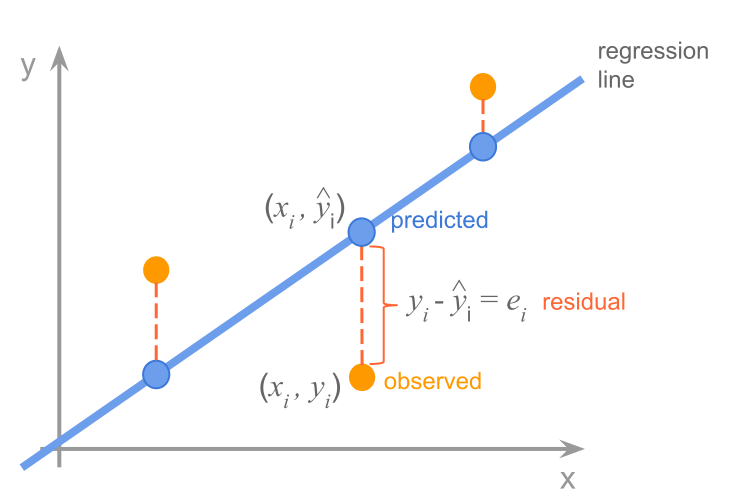

## Linear Regression

Linear regression is a statistical method for modeling the relationship between a dependent variable and one or more independent variables. It is one of the most widely used machine learning algorithms, and it is often the first algorithm that learners are introduced to.

Linear regression works by finding a linear equation that best fits the data. The linear equation is then used to predict the value of the dependent variable for new values of the independent variables.

The linear equation that is used to predict the dependent variable is called the regression equation. The regression equation is typically in the form of:

```math
y = mx + b
```

`y` is the dependent variable, `x` is the independent variable, `m` is the slope of the regression line, `b` is the y-intercept of the regression line

The slope and y-intercept of the regression line are estimated using the data. The slope represents the change in the dependent variable for a one-unit change in the independent variable. For example, if the slope of the line is positive, it means that there is a positive correlation between the input and output variables. This means that as the input variable increases, the output variable also tends to increase.

The y-intercept represents the value of the dependent variable when the independent variable is zero.

### Why is Linear Regression Useful?
Linear regression is a very useful algorithm because it is simple, interpretable, and accurate. It is also very versatile and can be used to solve a wide range of problems, such as:

- Predicting house prices
- Forecasting sales
- Predicting customer churn
- Predicting patient risk
- Predicting student performance
  
Suppose we want to predict the price of a house based on its square footage. We can collect data on the square footage and price of a number of houses. We can then use linear regression to find a linear equation that best fits the data. The linear equation can then be used to predict the price of a new house based on its square footage.

### How Linear Regression Works
Linear regression works by finding the best-fit line through the data. The best-fit line is the line that minimizes the sum of the squared residuals (SSE). The residual is the difference between the predicted value and the actual value.



To find the best-fit line, linear regression uses an algorithm called ordinary least squares (OLS). OLS works by iteratively adjusting the parameters of the linear equation until the SSE is minimized.

Once the best-fit line has been found, it can be used to predict the output variable for new input values. To do this, simply plug the input values into the linear equation.

### Linear Regression Assumptions

- __Linearity__: There must be a linear relationship between the input and output variables.
- __Homoscedasticity__: The variance of the error term must be constant.
- __Normality__: The error term must be normally distributed.
- __Independence__: The input variables must be independent of each other.

#### What to do if the linear regression assumptions are violated

- __Transform the data__: You can try transforming the data to make it more linear, homoscedastic, and/or normally distributed.
- __Use a robust regression algorithm__: Robust regression algorithms are less sensitive to violations of the linear regression assumptions.
- __Use a generalized linear model (GLM)__: GLMs are a class of machine learning algorithms that can be used to model non-linear relationships and non-normal target variables.

### How to evaluate Linear Regression

There are a number of ways to evaluate the performance of a linear regression model. Some common metrics include:

- __Mean squared error (MSE)__: The average squared difference between the predicted and actual values.
- __Mean absolute error (MAE)__: The average absolute difference between the predicted and actual values.
- __R-squared__: A measure of how well the model explains the variation in the output variable.
- __Adjusted R-squared__: A version of R-squared that takes into account the number of predictors in the model.

#### How to choose the best evaluation metric

The best evaluation metric to choose for a linear regression model will depend on the specific problem that you are trying to solve. Some factors to consider when choosing an evaluation metric include:

- __The type of data that you are using__: If your data contains outliers, then you may want to choose a metric that is robust to outliers, such as MAE.
- __The scale of your data__: If your data is on a very large scale, then you may want to choose a metric that is computationally efficient, such as MSE.
- __The interpretability of the metric__: Some metrics, such as R-squared, are more interpretable than others. This may be important if you need to explain the results of your model to stakeholders.

Here are some specific examples of when to choose each evaluation metric:

- __MSE__ is a good choice for evaluating the performance of a linear regression model on data that is normally distributed and does not contain outliers. MSE is also a good choice for problems where it is important to minimize the squared error between the predicted and actual values.
- __MAE__ is a good choice for evaluating the performance of a linear regression model on data that may contain outliers. MAE is also a good choice for problems where it is important to minimize the absolute error between the predicted and actual values.
- __R-squared__ is a good choice for evaluating the overall fit of a linear regression model to the data. However, it is important to note that R-squared can be misleading if the model is overfitting the data.
- __Adjusted R-squared__ is a good choice for evaluating the performance of a linear regression model on data that has multiple predictors. Adjusted R-squared penalizes models with more predictors, which helps to prevent overfitting.

