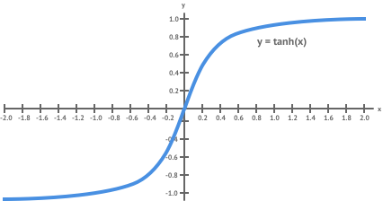
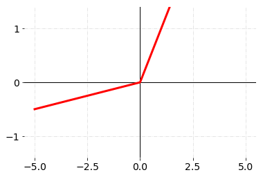
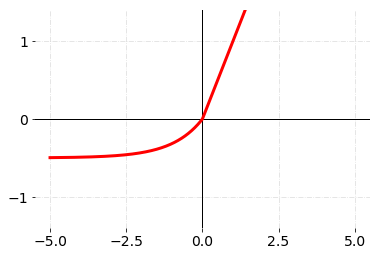
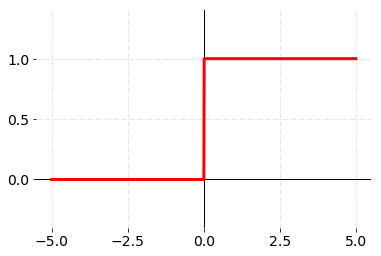
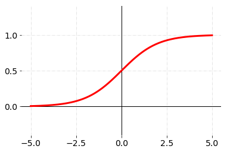
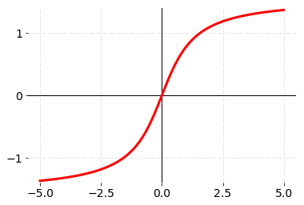
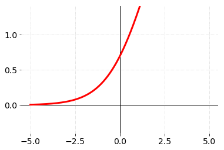
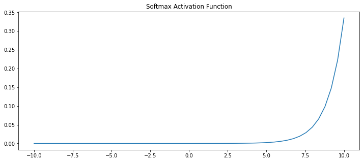
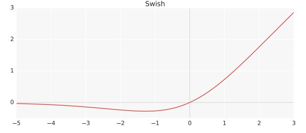

## Activation functions

- [Hyperbolic Tangent, tanh(x)](#hyperbolic-tangent-tanhx)
- [ReLU](#relu)
- [Leaky ReLU](#leaky-rectified-linear-units-leaky-relu)
- [ELU](#exponential-linear-units-elu)
- [Binary Step](#binary-step)
- [Sigmoid](#sigmoid)
- [ArcTan](#arctangent-arctan)
- [SoftPlus](#softplus)
- [Softmax](#softmax)
- [Swish](#swish)

Activation functions serve two primary purposes:

1) __Help a model account for interaction effects.__
What is an interactive effect? It is when one variable A affects a prediction differently depending on the value of B.
For example, if my model wanted to know whether a certain body weight indicated an increased risk of diabetes, it would have to know an individual's height.
Some bodyweights indicate elevated risks for short people, while indicating good health for tall people.
So, the effect of body weight on diabetes risk depends on height, and we would say that weight and height have an interaction effect.

3) __Help a model account for non-linear effects.__ This just means that if I graph a variable on the horizontal axis, and my predictions on the vertical axis, it isn't a straight line.
4) Or said another way, the effect of increasing the predictor by one is different at different values of that predictor.

### Hyperbolic Tangent, tanh(x)

```math

f(x) = \frac{2}{1+e^{-2x}}-1
```



The tanh would seem to have a couple advantages. Even though it gets close to flat, it isn't completely flat anywhere. 
So it's output always reflects changes in it's input, which we might expect to be a good thing. 
Secondly, it is non-linear (or curved everywhere). Accounting for non-linearities is one of the activation function's main purposes.
So, we expect a non-linear function to work well.

However researchers had great difficulty building models with many layers when using the tanh function. 
It is relatively flat except for a very narrow range (that range being about -2 to 2). 
The derivative of the function is very small unless the input is in this narrow range, and this flat derivative makes it difficult to improve the weights through gradient descent. 
This problem gets worse as the model has more layers. This was called the vanishing gradient problem.

__Advantages__:

+ Zero-centric- it accommodates large positive and negative values because if calculates local (or global) minimum 
quickly as derivatives of the tanh are larger than the derivatives of the sigmoid. It can minimize the cost function           faster.

__Disadvantages__:

- Vanishing gradient problem

### ReLU

The Rectified Linear Unit is the most commonly used activation function in deep learning models. The function returns 0 if it receives any negative input, but for any positive value  x
  it returns that value back. So it can be written as  _f(x)=max(0,x)_.
```math
f(x) =
  \begin{cases}
    0       & \quad \text{for } x \leq 0\
    x  & \quad \text{for } x >0
  \end{cases}
```


  
__Interactions__: Imagine a single node in a neural network model. For simplicity, assume it has two inputs, called A and B.
The weights from A and B into our node are 2 and 3 respectively. So the node output is  _f(2A+3B)_.
We'll use the ReLU function for our f. So, if  _2A+3B_ is positive, the output value of our node is also  _2A+3B_.
If  _2A+3B_ is negative, the output value of our node is 0.

For concreteness, consider a case where A=1 and B=1. The output is _2A+3B_, and if A increases, then the output increases too.
On the other hand, if B=-100 then the output is 0, and if A increases moderately, the output remains 0.
So A might increase our output, or it might not. It just depends what the value of B is.

This is a simple case where the node captured an interaction. As you add more nodes and more layers, the potential complexity of interactions only increases. 
But you should now see how the activation function helped capture an interaction.

__Non-linearities__: A function is non-linear if the slope isn't constant. 
So, the ReLU function is non-linear around 0, but the slope is always either 0 (for negative values) or 1 (for positive values). 
That's a very limited type of non-linearity.

But two facts about deep learning models allow us to create many different types of non-linearities from how we combine ReLU nodes.

First, most models include a bias term for each node. The bias term is just a constant number that is determined during model training. 
For simplicity, consider a node with a single input called A, and a bias. If the bias term takes a value of 7, then the node output is _f(7+A)_. 
In this case, if A is less than -7, the output is 0 and the slope is 0. If A is greater than -7, then the node's output is _7+A_, and the slope is 1.

So the bias term allows us to move where the slope changes. So far, it still appears we can have only two different slopes.

However, real models have many nodes. Each node (even within a single layer) can have a different value for it's bias, so each node can change slope at different values for our input.

When we add the resulting functions back up, we get a combined function that changes slopes in many places.

These models have the flexibility to produce non-linear functions and account for interactions well (if that will giv better predictions). 
As we add more nodes in each layer (or more convolutions if we are using a convolutional model) the model gets even greater ability to represent these interactions and non-linearities.

The ReLU function has a derivative of 0 over half it's range (the negative numbers). For positive inputs, the derivative is 1.

When training on a reasonable sized batch, there will usually be some data points giving positive values to any given node. 
So the average derivative is rarely close to 0, which allows gradient descent to keep progressing.

__Advantages__:

+ Simple and computationally efficent 
+ No vanishing gradient problem- as the input remains the same
+ Non-linear 
+ Sparsity- increases speed of the model by removing unwanted features(Most of the times)

__Disadvantages__:

- Dead Neurons- the gradient(slope) in the negative region is 0 deactivates the neurons which cannot be changed during            backpropagation and optimization.
- Cannot be used as the activation function for final layer.

### Leaky Rectified Linear Units, Leaky ReLU

```math
f(x) =
  \begin{cases}
    ax       & \quad \text{for } x \leq 0\
    x  & \quad \text{for } x >0
  \end{cases}
```


AF that introduce some small negative slope to the ReLU to sustain and keep the weight updates alive during the entire propagation process

The alpha parameter was introduced as a solution to the ReLUs dead neuron problems such that the gradients will not be zero at any time during training

__Advantange__:

+ Prevents the dead neurons problem- due to the replacement of negative values the neurons do not deactive and block 
 from active backpropagation.

__Disadvantage__:

-  Output not constant ## check

### Exponential Linear Units, ELU

```math
f(x) =
  \begin{cases}
    a(e^x - 1)       & \quad \text{for } x \leq 0\
    x  & \quad \text{for } x >0
  \end{cases}
```


This activation function fixes some of the problems with ReLUs and keeps some of the positive things. For this activation function, an alpha α value is picked; a common value is between 0.1 and 0.3.

The y-value you get depends both on your x-value input, but also on a parameter alpha α , which you can adjust as needed. Furthermore, we introduce an exponential operation e x , which means the ELU is more computationally expensive than the ReLU.

Used in hidden layers

### Binary Step

```math

f(x) =
  \begin{cases}
    0       & \quad \text{for } x \leq 0\
    1  & \quad \text{for } x >0
  \end{cases}
```


The function produces binary output. That is the reason why it also called as binary step function. The function produces 1 (or true) when input passes threshold limit whereas it produces 0 (or false) when input does not pass threshold. That’s why, they are very useful for binary classification studies.

Step function is useless in backpropagation because it cannot be backpropageted.

### Sigmoid

```math

f(x) = \frac{1}{1+e^{-x}}
```



Sigmoid function appears in the output layers of the DL architectures, and they are used for predicting probability based output and has been applied successfully in binary classification problems, modeling logistic regression tasks as well as other neural network domains

The main reason why we use sigmoid function is because it exists between (0 to 1)

__Advantages__:

+ Simple and smooth curve
+ Clear predictions
+ Can be used in any layer including the output layer

__Disadvantages__:

- Non-Zero centric- for large negative and positive values the output is positive and in opposite directions but 
between [0,1] which makes it difficult to calculate gradient for such small values. 
- Vanishing Gradient- the change in predicted values for large positive numbers is infinitesimal.
- The calculation is computationally complex for large networks.

Sigmoid AF suffers major drawbacks which include sharp damp gradients during backpropagation from deeper hidden layers to the input layers which make it slow so Hard sigmoid function solve this problem

Usually used in output layer

### Arctangent, ArcTan

```math

f(x) = \tan^{-1}(x)
```



### SoftPlus

```math

f(x) = \ln(1+e^x)
```



### Softmax
```math
f (x_i) = \frac{x_i}{\sum_{j} x_j}
```

The softmax function is also a type of sigmoid non-linear function but is handy when we are trying to handle classification problems.

Usually used when trying to handle multiple classes. It is a form of logistic regression that normalizes an input value into a vector of values that follows a probability distribution whose total sums up to 1. Neural networks model classifies the instance as a class that have an index of the maximum output.

__Advantange__:

+ Multi-dimensional classification
+ Generally used as output neuron

### Swish
```math
f(x) = x · sigmoid(x) = \frac{1}{x+e^{-x}}
```


Their experiments show that Swish tends to work better than ReLU on deeper models across a number of challenging data sets.

With ReLU, the consistent problem is that its derivative is 0 for half of the values of the input x in ramp Function, i.e. `f(x)=max(0,x)`. As their parameter update algorithm, they have used Stochastic Gradient Descent and if the parameter itself is 0, then that parameter will never be updated as it just assigns the parameter back to itself, leading close to 40% Dead Neurons in the Neural network environment when θ=θ. Various substitutes like Leaky ReLU or SELU (Self-Normalizing Neural Networks) have unsuccessfully tried to devoid it of this issue but now there seems to be a revolution for good.

In very deep networks, Swish achieves higher test accuracy than ReLU. In terms of batch size, the performance of both activation functions decrease as batch size increases

