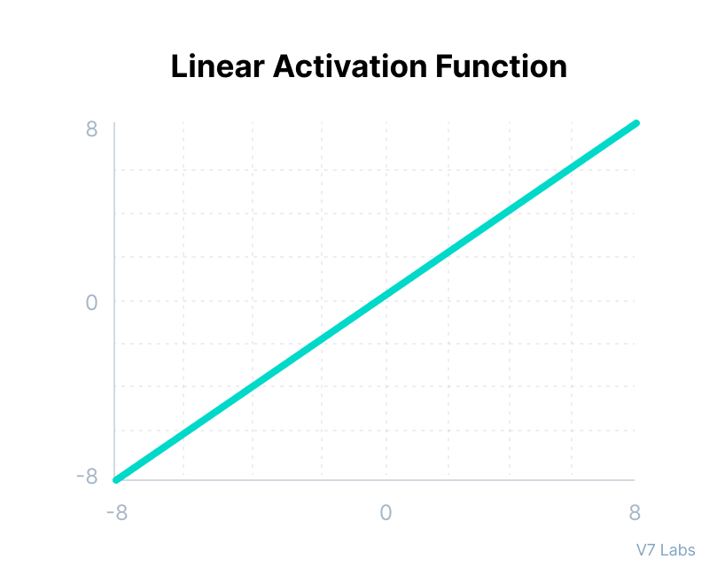
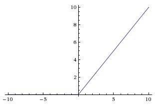

## Activation functions

__An Activation Function__ decides whether a neuron should be activated or not. This means that it will decide whether the neuron’s input to the network is important or not in the process of prediction using simpler mathematical operations.
> Note: All hidden layers usually use the same activation function. However, the output layer will typically use a different activation function from the hidden layers. The choice depends on the goal or type of prediction made by the model.

> Without activation function learning any complex task is impossible, and our model would be just a linear regression model.

| Activation function | Layer | Advantages | Disadvantages |
| --- | --- | --- | --- |
| [Binary Step](#binary-step) | output | + useful for binary classification studies | - useless in backpropagation because it cannot be backpropageted - The gradient of the step function is zero, which causes a hindrance in the backpropagation process. <br> - It cannot provide multi-value outputs—for example, it cannot be used for multi-class classification problems. |
| [Linear Function](#linear-function) | --- | --- | - It’s not possible to use backpropagation as the derivative of the function is a constant and has no relation to the input x.  <br> - All layers of the neural network will collapse into one if a linear activation function is used. No matter the number of layers in the neural network, the last layer will still be a linear function of the first layer. So, essentially, a linear activation function turns the neural network into just one layer. |
| [Sigmoid / Logistic](#sigmoid) | both | + Simple and smooth curve <br> + Clear predictions, since probability of anything exists only between the range of 0 and 1 <br> + Can be used in any layer including the output layer | - Non-Zero centric - for large negative and positive values the output is positive and in opposite directions but between [0,1] which makes it difficult to calculate gradient for such small values. <br> - Vanishing Gradient - the change in predicted values for large positive numbers is infinitesimal. <br> - The calculation is computationally complex for large networks. |
| [tanh(x)](#hyperbolic-tangent-tanhx) | both | + Zero-centric - its mean is 0 or near to it which helps in centering the data. It accommodates large positive and negative values because if calculates local (or global) minimum quickly as derivatives of the tanh are larger than the derivatives of the sigmoid. It can minimize the cost function faster. | - Vanishing gradient problem <br> - Plus the gradient of the tanh function is much steeper as compared to the sigmoid function. <br> - in hidden layers make the model more susceptible to problems during training (due to vanishing gradients)|
| [ReLU](#relu) | only hidden | + Simple and computationally efficent <br> + No vanishing gradient problem - as the input remains the same<br> + Non-linear - effective in converting linear combinations of inputs into non-linear outputs, which can help to capture more complex relationships <br> + Sparsity - increases speed of the model by removing unwanted features (Most of the times) | - Dead Neurons - the gradient(slope) in the negative region is 0 deactivates the neurons which cannot be changed during backpropagation and optimization. <br> - Cannot be used as the activation function for final layer, because we need to ensure that the predicted values are in a specific range |
| [Leaky ReLU](#leaky-rectified-linear-units-leaky-relu) | hidden | + Prevents the dead neurons problem - due to the replacement of negative values the neurons do not deactive and block | - The gradient for negative values is a small value that makes the learning of model parameters time-consuming |
| [ELU](#exponential-linear-units-elu) | hidden | + Prevents the dead neurons problem <br> + ELU becomes smooth slowly until its output equal to -α whereas RELU sharply smoothes| - more computationally expensive than the ReLU because of the exponential operation included <br> - No learning of the ‘a’ value takes place <br> - Exploding gradient problem |
| [Softmax](#softmax) | output | + Multi-dimensional classification <br> + Generally used as output neuron | ? |
| [Swish](#swish) | hidden (a depth greater than 40 layers) | + Small negative values were zeroed out in ReLU activation function. However, those negative values may still be relevant for capturing patterns underlying the data. Large negative values are zeroed out for reasons of sparsity making it a win-win situation. <br> + The swish function being non-monotonous enhances the expression of input data and weight to be learnt. | ? |

Finally, a few rules for choosing the activation function for your output layer based on the type of prediction problem that you are solving:

1. __Regression__ - Linear Activation Function
2. __Binary Classification__ — Sigmoid/Logistic Activation Function
3. __Multiclass Classification__ — Softmax
4. __Multilabel Classification__ — Sigmoid
   
The activation function used in hidden layers is typically chosen based on the type of neural network architecture.

1. __Convolutional Neural Network (CNN)__: ReLU activation function.
2. __Recurrent Neural Network (RNN)__: Tanh and/or Sigmoid activation function.

Activation functions serve two primary purposes:

1) __Help a model account for interaction effects.__
What is an interactive effect? It is when one variable A affects a prediction differently depending on the value of B.
For example, if my model wanted to know whether a certain body weight indicated an increased risk of diabetes, it would have to know an individual's height.
Some bodyweights indicate elevated risks for short people, while indicating good health for tall people.
So, the effect of body weight on diabetes risk depends on height, and we would say that weight and height have an interaction effect.
<br>Imagine a single node in a neural network model. For simplicity, assume it has two inputs, called A and B.
The weights from A and B into our node are 2 and 3 respectively. So the node output is  _f(2A+3B)_.
We'll use the ReLU function for our f. So, if  _2A+3B_ is positive, the output value of our node is also  _2A+3B_.
If  _2A+3B_ is negative, the output value of our node is 0.
<br>For concreteness, consider a case where A=1 and B=1. The output is _2A+3B_, and if A increases, then the output increases too.
On the other hand, if B=-100 then the output is 0, and if A increases moderately, the output remains 0.
So A might increase our output, or it might not. It just depends what the value of B is.
<br>This is a simple case where the node captured an interaction. As you add more nodes and more layers, the potential complexity of interactions only increases. 
But you should now see how the activation function helped capture an interaction.

2) __Help a model account for non-linear effects.__ This just means that if I graph a variable on the horizontal axis, and my predictions on the vertical axis, it isn't a straight line. Or said another way, the effect of increasing the predictor by one is different at different values of that predictor.
<br>A function is non-linear if the slope isn't constant. 
<br>First, most models include a bias term for each node. The bias term is just a constant number that is determined during model training. 
For simplicity, consider a node with a single input called A, and a bias. If the bias term takes a value of 7, then the node output is _f(7+A)_. 
In this case, if A is less than -7, the output is 0 and the slope is 0. If A is greater than -7, then the node's output is _7+A_, and the slope is 1.
<br>So the bias term allows us to move where the slope changes. So far, it still appears we can have only two different slopes.
<br>However, real models have many nodes. Each node (even within a single layer) can have a different value for it's bias, so each node can change slope at different values for our input.
<br>When we add the resulting functions back up, we get a combined function that changes slopes in many places.
<br>These models have the flexibility to produce non-linear functions and account for interactions well (if that will giv better predictions). 
As we add more nodes in each layer (or more convolutions if we are using a convolutional model) the model gets even greater ability to represent these interactions and non-linearities.

### Binary Step

```math

f(x) =
  \begin{cases}
    0       & \quad \text{for } x \leq 0\
    1  & \quad \text{for } x >0
  \end{cases}
```


Binary step function depends on a threshold value that decides whether a neuron should be activated or not. 

The input fed to the activation function is compared to a certain threshold; if the input is greater than it, then the neuron is activated, else it is deactivated, meaning that its output is not passed on to the next hidden layer.

Cannot be used in an output layer - linear piecewise function unable to handle complex representations

That’s why, they are very useful for binary classification studies.

Step function is useless in backpropagation because it cannot be backpropageted.

### Linear Function

```math

f(x) = x
```



The linear activation function, also known as "no activation," or "identity function" (multiplied x1.0), is where the activation is proportional to the input.

The function doesn't do anything to the weighted sum of the input, it simply spits out the value it was given.

### Sigmoid

```math

f(x) = \frac{1}{1+e^{-x}}
```


Sigmoid function appears in the output layers of the DL architectures, and they are used for predicting probability based output and has been applied successfully in binary classification problems, modeling logistic regression tasks as well as other neural network domains

The main reason why we use sigmoid function is because it exists between (0 to 1). The larger the input (more positive), the closer the output value will be to 1.0, whereas the smaller the input (more negative), the closer the output will be to 0.0.

Sigmoid AF suffers major drawbacks which include sharp damp gradients during backpropagation from deeper hidden layers to the input layers which make it slow so Hard sigmoid function solve this problem

Usually used in output layer

### Hyperbolic Tangent, tanh(x)

```math

f(x) = \frac{2}{1+e^{-2x}}-1
```


Tanh function is very similar to the sigmoid/logistic activation function, and even has the same S-shape with the difference in output range of -1 to 1. In Tanh, the larger the input (more positive), the closer the output value will be to 1.0, whereas the smaller the input (more negative), the closer the output will be to -1.0.

The tanh would seem to have a couple advantages. Even though it gets close to flat, it isn't completely flat anywhere. 
So it's output always reflects changes in it's input, which we might expect to be a good thing. 
Secondly, it is non-linear (or curved everywhere). Accounting for non-linearities is one of the activation function's main purposes.
So, we expect a non-linear function to work well.

However researchers had great difficulty building models with many layers when using the tanh function. 
It is relatively flat except for a very narrow range (that range being about -2 to 2). 
The derivative of the function is very small unless the input is in this narrow range, and this flat derivative makes it difficult to improve the weights through gradient descent. 
This problem gets worse as the model has more layers. This was called the vanishing gradient problem.

> Note:  Although both sigmoid and tanh face vanishing gradient issue, tanh is zero centered, and the gradients are not restricted to move in a certain direction. Therefore, in practice, tanh nonlinearity is always preferred to sigmoid nonlinearity.

### ReLU

The Rectified Linear Unit is the most commonly used activation function in deep learning models. The function returns 0 if it receives any negative input, but for any positive value  x
  it returns that value back. So it can be written as  _f(x)=max(0,x)_.
```math
f(x) =
  \begin{cases}
    0       & \quad \text{for } x \leq 0\
    x  & \quad \text{for } x >0
  \end{cases}
```


  
So, the ReLU function is non-linear around 0, but the slope is always either 0 (for negative values) or 1 (for positive values). 
That's a very limited type of non-linearity.

The ReLU function has a derivative of 0 over half it's range (the negative numbers). For positive inputs, the derivative is 1.

When training on a reasonable sized batch, there will usually be some data points giving positive values to any given node. 
So the average derivative is rarely close to 0, which allows gradient descent to keep progressing.

### Leaky Rectified Linear Units, Leaky ReLU

```math
f(x) =
  \begin{cases}
    ax       & \quad \text{for } x \leq 0\
    x  & \quad \text{for } x >0
  \end{cases}
```


AF that introduce some small negative slope to the ReLU to sustain and keep the weight updates alive during the entire propagation process

The alpha parameter was introduced as a solution to the ReLUs dead neuron problems such that the gradients will not be zero at any time during training

### Exponential Linear Units, ELU

```math
f(x) =
  \begin{cases}
    a(e^x - 1)       & \quad \text{for } x \leq 0\
    x  & \quad \text{for } x >0
  \end{cases}
```


This activation function fixes some of the problems with ReLUs and keeps some of the positive things. For this activation function, an alpha α value is picked; a common value is between 0.1 and 0.3.

The y-value you get depends both on your x-value input, but also on a parameter alpha α , which you can adjust as needed. Furthermore, we introduce an exponential operation e x , which means the ELU is more computationally expensive than the ReLU.

Used in hidden layers

### Softmax
```math
f (x_i) = \frac{x_i}{\sum_{j} x_j}
```


The softmax function is also a type of sigmoid non-linear function but is handy when we are trying to handle classification problems.

Usually used when trying to handle multiple classes. It is a form of logistic regression that normalizes an input value into a vector of values that follows a probability distribution whose total sums up to 1. Neural networks model classifies the instance as a class that have an index of the maximum output.

### Swish
```math
f(x) = x · sigmoid(x) = \frac{1}{x+e^{-x}}
```


It is a self-gated activation function developed by researchers at Google. 

Swish consistently matches or outperforms ReLU activation function on deep networks applied to various challenging domains such as image classification, machine translation etc.

Their experiments show that Swish tends to work better than ReLU on deeper models across a number of challenging data sets.

With ReLU, the consistent problem is that its derivative is 0 for half of the values of the input x in ramp Function, i.e. `f(x)=max(0,x)`. As their parameter update algorithm, they have used Stochastic Gradient Descent and if the parameter itself is 0, then that parameter will never be updated as it just assigns the parameter back to itself, leading close to 40% Dead Neurons in the Neural network environment when θ=θ. Various substitutes like Leaky ReLU or SELU (Self-Normalizing Neural Networks) have unsuccessfully tried to devoid it of this issue but now there seems to be a revolution for good.

In very deep networks, Swish achieves higher test accuracy than ReLU. In terms of batch size, the performance of both activation functions decrease as batch size increases

