# Find middle lane line with perspective transformations

0. For testing purposes unzip archiv in the [images folder](images)
1. [Calibrate your camera and undistort images](../calibration) (images in zip are already undistorted)
2. Get matrices for perspective transformation:
   - I got them automatically using my ROS package [`PathFromImage`](https://github.com/CatUnderTheLeaf/path_from_image) that I used in [`rosRoboCar`](https://github.com/CatUnderTheLeaf/rosRoboCar) project. For this purpose you need to broadcast CameraInfo, robot URDF model and TF
     ```
     transform_matrix = np.array(
                            [[-1.44070347e+00, -2.24787583e+00,  5.03003158e+02],
                            [ 5.54569940e-16, -4.76928443e+00,  7.40727232e+02],
                            [ 1.37242848e-18, -1.09231360e-02,  1.00000000e+00]])

     inverse_matrix =np.array(
        	            [[4.83440511e-01, -4.72483945e-01,  1.06809629e+02],
                        [ 1.49479041e-16, -2.09675060e-01,  1.55312027e+02],
                        [ 9.62443421e-19, -2.29030920e-03,  1.00000000e+00]])
     ```
   - or you can manually get them with hardcoded points:
     ```
     # these numbers are only for snippet code purpose
     # get them by yourself
     
     # point locations on the image
  	  src = np.float32([[200, shape[0]],[593, 450],[shape[1]-590, 450],[shape[1]-160, shape[0]]])
     # desired locations on the future image
      dst = np.float32([[300, shape[0]],[300, 0],[shape[1]-300, 0],[shape[1]-300, shape[0]]])

     # get matrices
      transform_matrix = cv2.getPerspectiveTransform(src, dst)
      inverse_matrix = cv2.getPerspectiveTransform(dst, src)
     ```
3. Make a thresholded binary image. I tried two methods:
   - convert to grey, apply GaussianBlur with kernel=5, apply Canny Edge Detector and warp image 

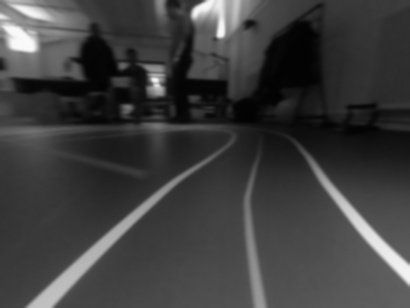
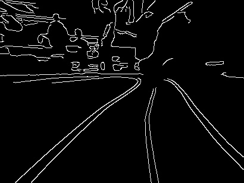
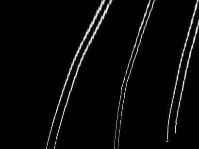
   - catch yellow middle line. First I warped image and then made a combined treshold `yellow_output[(sxbinary == 1) & (lab_binary == 1) & (s_binary != 1)] = 1`, where:
     - lab_binary - convert to LAB color space and treshold b-channel (for yellow and blue colors)
     - sxbinary - convert to HLS color space, apply Sobel Operator in x-direction of the l-channel and treshold it
     - s_binary - convert to HLS color space, treshold s-channel, in the formula it is with negation to remove big part of the white lines
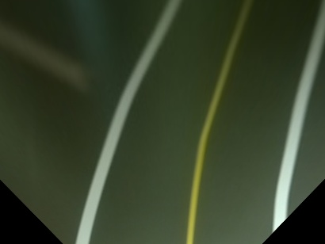
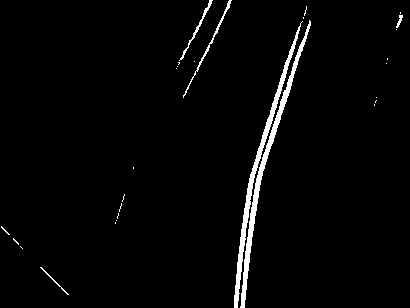
4. Apply GaussianBlur with kernel=21 to smooth lines and make a histogram of the bottom half/third, find peaks with `scipy.signal.find_peaks` - these are the starting points for sliding windows. 
   <p align="center">
     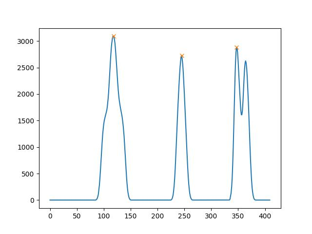
     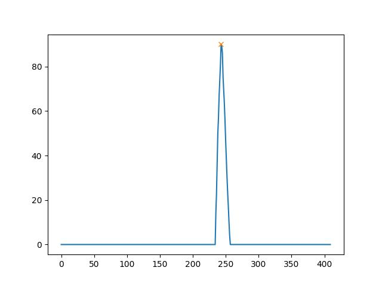
   </p>
   
   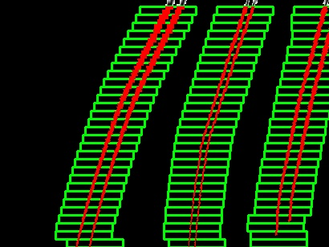
   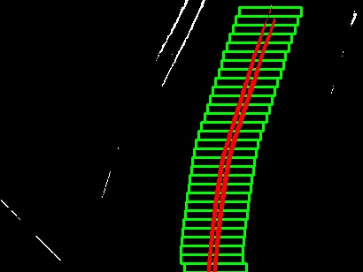
6. Fit polynomial with `np.polyfit()` and draw a polyline on the empty image
   
   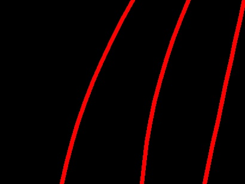
   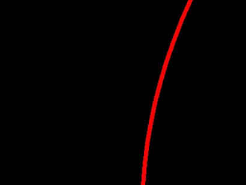
7. Unwarp this image using `inverse_matrix` and combine with original image using `cv2.addWeighted()`
    
   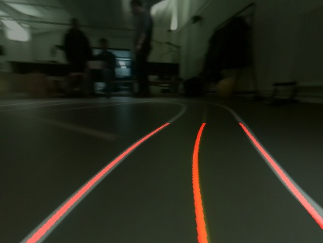
   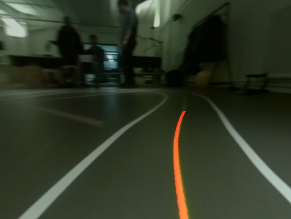   
