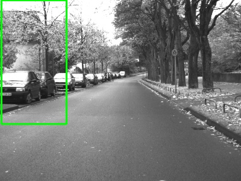
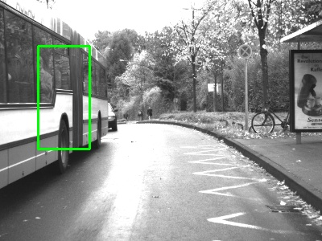
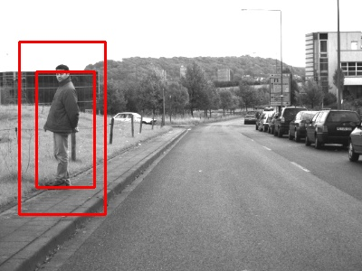
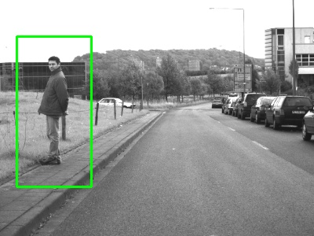

# Pedestrian detection with HOG and Linear SVM model

0. Prepare images with pedestrians. I used test set from Daimler Pedestrian Detection Benchmark Dataset[^1]
1. Initiate HOGDescriptor and load default people detector
   ```
    hog = cv2.HOGDescriptor()
    hog.setSVMDetector( cv2.HOGDescriptor_getDefaultPeopleDetector() )
   ```
2. Resize image to improve accuracy and time efficiency
3. Detect pedestrians with `hog.detectMultiScale()`
   - the problem was that it should be same parameters for the whole dataset and on some frames it worked good on another frames - there were false-positive or missing detections
   - smaller `winStride` and `scale` increase detection time and are not useful for real-time applications 
   - Here are examples of bad parameters:

   
   
     
4. Reduce the number of detected boxes with non-maximum suppression
   
   
   

5. Here are four videos with `winStride=(4, 6), padding=(2, 2), scale=1.19` detect parameters:

   
   
   
   


[^1]: M. Enzweiler and D. M. Gavrila. “Monocular Pedestrian Detection: Survey and Experiments”. IEEE Trans. on Pattern Analysis and Machine Intelligence, vol.31, no.12, pp.2179-2195, 2009. [Daimler Pedestrian Detection Benchmark Dataset](http://www.gavrila.net/Datasets/Daimler_Pedestrian_Benchmark_D/Daimler_Mono_Ped__Detection_Be/daimler_mono_ped__detection_be.html)
