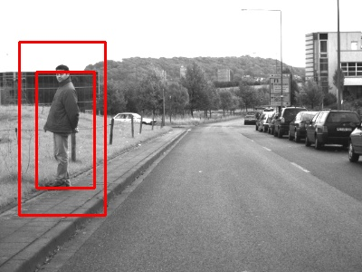
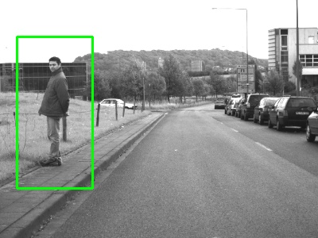

# Pedestrian detection with HOG and Linear SVM model

0. Prepare images with pedestrians. I used test set from Daimler Pedestrian Detection Benchmark Dataset[^1]
1. Initiate HOGDescriptor and load default people detector
   ```
    hog = cv2.HOGDescriptor()
    hog.setSVMDetector( cv2.HOGDescriptor_getDefaultPeopleDetector() )
   ```
2. Resize image to improve accuracy and time efficiency
3. Detect pedestrians with `hog.detectMultiScale()`
   - after experiments with different values I chose `winStride=(4, 6), padding=(2, 2), scale=1.19`
4. Reduce the number of detected boxes with non-maximum suppression
   
   


[^1]: [Daimler Pedestrian Detection Benchmark Dataset](http://www.gavrila.net/Datasets/Daimler_Pedestrian_Benchmark_D/Daimler_Mono_Ped__Detection_Be/daimler_mono_ped__detection_be.html)
